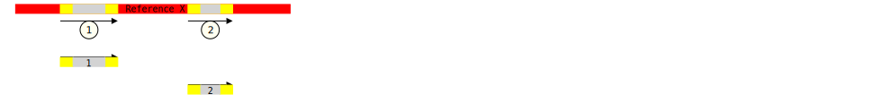

DeNovo assembly does not invariably translate input reads into a
single contiguous sequence akin to a genomic consensus.  Typically,
errors in input data lead to fragmented sequences — referred to as
contigs — which furthermore may overlap, thus encoding the same region
of a genome more than once.  Assembling a unified consensus sequence
necessitates the systematic arrangement of these contigs while
addressing discrepancies within overlapping regions. That is the
Stitcher's function.

# Structure

The Stitcher is a specialized component within the MiCall system. It
is designed to operate as an independent module which processes the
assembled contigs, generally derived from DeNovo assembler outputs,
and produce a singular, coherent sequence.

## Modular Aspect

The Stitcher maintains a distinct and autonomous role within
MiCall. Its implementation is fully isolated to the
`contig_stitcher*.py` files within the MiCall's source code. The
stitcher module can be run as a CLI script, separately from the rest
of the pipeline. The following command runs the Stitcher:

```sh
micall contig_stitcher --help
```

<!-- ## Functionality as a Black-Box -->

<!-- TODO(20): consider adding something useful into this section. -->

<!-- As many other MiCall components, the Stitcher functions as a black-box -->
<!-- in the workflow, meaning it takes defined inputs and processes them to -->
<!-- generate outputs, without necessitating user interaction with its -->
<!-- internal mechanics. -->

## Interaction

Stitching is initiated either as a pipeline step in MiCall, or as a
command line call given above. In each case:

**Input:** The Stitcher receives a single input file in CSV
format. This file contains 1 or more contigs that are the outcomes of
the previous assembly step, together with associated reference genome
information. These contigs are essentially segments of DNA
sequences. They can vary significantly in length.

**Output:** The sole output from the Stitcher is a CSV
file. This file holds the stitched sequences -- longer or fully
continuous sequences that represent the genomic consensus formed by
merging the initial fragmented contigs, and additional metadata,
such as the inferred reference genome's name.

<!-- TODO(2): it would be nice to have the pipeline dataflow diagram to link to here. -->

# Operational procedure

To clarify operations of the Stitcher, the subsequent section
introduces a vocabulary that is necessary for a precise description.

## Definitions

- An **input nucleotide** refers to a nucleotide of an initial
  assembly contig sequence.
- A **reference nucleotide** refers to a nucleotide of a reference
  genome sequence.
- A **non-conflicting nucleotide** is a **reference nucleotide** that
  has at most one candidate **input nucleotide**.
- A **non-ambiguous nucleotide** is an **input nucleotide**, which has
  a clear positioning with respect to all **input nucleotides** of all
  other contigs associated with the same reference genome. In
  particular, all **conflicting nucleotides** are **ambiguous
  nucleotides** because they do not have a clear positioning with
  respect to their competing **conflicting nucleotide**.
- An **overlap** is a continuos segement of **conflicting
  nucleotides**.
- **Multidirectional alignment** is a property of a contig such that:
   1. the contig has aligned in multiple parts.
   2. some parts have been aligned to the forward strand, and some to
      the reverse strand of the reference genome.
- **Cross-alignment** is a property of a contig such that:
   1. the contig has aligned in multiple parts.
   2. the contig-order of the aligned parts does not agree with the
      reference-order of the aligned parts.
- A **non-aligned contig** is a contig that has been assinged a
  reference sequence, but did not align to it.
- An **invalid contig** is a contig with **multidirectional
  alignment**.
- A **stitched consensus** is a **valid contig** in the output of the
  Stitcher.
- The **final output** refers to the contents of the only output CSV
  file produced by the Stitcher.

## Principles

The reason the Stitcher operates effectively is due to its utilization
of reference genomes as additional source of truth.  More precisely,
the Stitcher integrates two sets of data:

1. Sequences generated by the initial assembly.
2. Sequences of reference genomes to which assembled contigs get aligned.

We will say that 1. is the assembler's data, and 2. is aligner's.

The core belief is that a reference genome can be used to enhance the
quality of and resolve conflicts within initial assembly contigs.

In applying this approach, the Stitcher is guided by the following principles:

### Principle of Scale-Dependent Credibility

The reliability of sequence alignments increases as the length of the
aligned segment increases.
Therefore:

- **Micro Scale**: For shorter segments, assembler's findings are more
  reliable, because of expected abundance of small, local mutations
  not present in the reference genome.

- **Macro Scale**: For longer segments, the aligner's interpretations
  are prioritized. The exponential decrease in alignment errors with
  increased sequence length makes long alignments particularly
  trustworthy.

### Principle of Length Prioritization

A longer contig typically arises from a greater number of reads
spanning a larger genomic region. While this does not imply more reads
per individual position, it suggests that the initial set of reads has
successfully assembled over a more extensive sequence, reflecting a
broader and more robust dataset. Moreover, aligning a longer sequence
to the reference genome is statistically less probable, compared to a
shorter sequence. This means that a successful alignment of a longer
contig to the reference genome provides further confidence in its
accuracy.

Therefore in scenarios where multiple contigs cover the same region of
the reference genome, longer contigs are prioritized over shorter
ones.

### Ambiguity Omission Principle

To mitigate the potential propagation of uncertainties, any data that
lacks a definitive, unambiguous position within the reference genome
should be entirely excluded. This approach acknowledges that absolute
certainty in complex genomic datasets is often unattainable, and tries
to establish a reasonable default.

## Regulations

Guided by the previously outlined principles,
several precise regulations governing the Stitcher can be extracted:

1. For every reference genome, at most one **stitched consensus**
   must result.
2. No **ambiguous, non-conflicting nucleotide**
   shall be included into the **final output**.
3. Every **non-conflicting-** and **non-ambiguous-** nucleotide
   pertaining to a **valid contig** is required to be included in the
   **stitched consensus** for the associated reference genome.
4. The relative positions of **non-conflicting-** and
   **non-ambiguous-** nucleotides must be preserved in the **final output**.
5. All nucleotides present in the **final output** must exclusively
   originate from the initial assembly data.

## Setup

The setup process for the Stitcher ensures that each contig is
properly aligned and prepared for the stitching process. The steps are
as follows:

1. **Align Contigs**: Align each contig to its corresponding reference
   genome to approximate their positions within a global reference
   framework, allowing for spatial comparison between different contigs.

2. **Split Multi-Alignment Contigs**: Split contigs that align to
   multiple distinct parts of the reference genome into separate
   segments.

3. **Handle Reverse Complement**: Reverse complement contigs that
   align to the reverse strand of the reference genome to ensure all
   sequences are oriented in the same direction.

4. **Sort Contigs**: Arrange the contigs based on their starting
   positions along the reference genome.

5. **Group by Reference**: Group contigs such that all contigs
   associated with the same reference genome are processed together.

These setup steps perform minimal alteration to the original contigs
and are primarily guided by straightforward, logical
considerations. Therefore, they do not require extensive
rationalization compared to the subsequent rules.

## Rules of operation

Stitching is an iterative process, governed by the following rules:

### Rule 1: Merge Non-Overlapping Contigs

1. **Verify Non-Overlap**: Ensure that the end of the first contig is
   less or equal to the start of the second contig according to their
   positions on the reference genome.

2. **Delete adjacent non-aligned parts**: Filter out any non-aligned
   nucleotides positioned after the first contig's aligned part and
   before the second contig's aligned part.

3. **Concatenate Sequences**: Directly join the end of the first
   contig to the start of the second contig.

#### Example:

**Input:**



- Contig 1: Sequence = `GG[ATGCCC]AA`, aligned to Referece X at
  position 10, with first two and last two nucleotides not aligned.
- Contig 2: Sequence = `AC[TTAG]TA`, aligned to Referece X at position
  30, with first two and last two nucleotides not aligned.

**Procedure:**
- Verify that Contig 1 ends before Contig 2 begins.
- Delete non-aligned nucleotides resulting in Contig 1 = `GG[ATGCCC]` and Contig 2 = `[TTAG]TA`.
- Concatenate Contig 1 and Contig 2 to form `GG[ATGCCC][TTAG]TA`.

**Result:**


- The new sequence, `GG[ATGCCCTTAG]TA`, spans positions 10 to 34 on the reference genome.

#### Rationale

There isn't many alternative actions available to us in these circumstances.
This enables us to consider all of them:

1. **Leaving contigs as separate**:

   Separate contigs would result in multiple consensus outputs for one genome.
   Thus it fails to comply with **regulation 1**.

2. **Omitting the strip step**:

   Note that the adjacent non-aligned nucleotides of the two sequences
   are **ambiguous, non-conflicting nucleotides**.  Therefore, leaving
   them in place violates **regulation 2**.

3. **Introducing additional modifications**:

   Since given contigs do not overlap, every nucleotide in them is **non-conflicting**.
   Additionally, we have stripped all the **ambiguous nucleotides**.
   Therefore, all modifications that can be introduced
   would either violate **regulation 3**, **regulation 4** or **regulation 5**.

### Rule 2: Merge Overlapping Contigs

1. **Verify Overlap**: Check if the ending position of the first
   contig is greater than the starting position of the second contig.

2. **Delete adjacent non-aligned parts**: Filter out any non-aligned
   nucleotides positioned after the first contig's aligned part and
   before the second contig's aligned part.

3. **Align Overlapping Regions**:
   - Extract the sequences from the overlapping region in both
     contigs.
   - Use a global alignment method to align these overlapping
     sub-sequences.

4. **Calculate Concordance Scores**:
   - Compute concordance scores for each position within the
     overlapping region. Importantly, the concordance calculation is
     done purely between the aligned overlapping subsequences of the
     contigs, with no regard to the reference genome sequence. The
     concordance score represents how well the nucleotides from the
     two contigs match at each position.
   - The score is calculated using a sliding average approach,
     emphasizing regions with high sequence agreement.

5. **Determine Optimal Cut Point**:
   - Identify the cut point based on the concordance scores such that
     the it lies in the middle of regions with the highest
     concordance.
   - This means making cuts as far away from disagreeing nucleotides
     as possible.

6. **Segment and Combine**:
   - Segment the overlapping sequences at the determined cut point.
   - Concatenate the non-overlapping parts of the contigs with the
     segmented parts from the overlapping region.

#### Example

**Input:**


- Contig 1: Sequence = `G[GGCC A--TAC]T T`, aligned to Reference X from positions 10 to 19.
- Contig 2: Sequence = `--CCAC[AAATAC C]GGG`, aligned to Reference X from positions 14 to 20.

**Procedure:**

1. **Verify Overlap**:
   - Contig 1 ends at position 19, and Contig 2 starts at position 14
     (both on Reference X), resulting in an overlap from positions 14
     to 19.

2. **Delete adjacent non-aligned parts**: Contig 1 is right-stripped
   to become `G[GGCCA--TAC]`, contig B is left-stripped to become
   `[AAATACC]GGG`.

3. **Align Overlapping Regions**:
   - The overlaping sequence is `A--TAC` from contig A, and `AAATAC`
     from contig B.
   - Align them globally to produce the following alignments: `--ATAC`
     and `AAATAC`

4. **Calculate Concordance**:
   - Calculate concordance scores for positions 15 to 20, considering
     only the overlap between the two aligned sequences.
   - Approximate concordance: `[0.1, 0.2, 0.3, 0.8, 0.8, 0.3]`.

5. **Determine Cut Point**:
   - Use the computed concordance scores to identify the cut point.
   - In this example, the highest concordance scores are around
     positions with the score 0.9, so choose it as the cut point.

   ```
   Aligned sequences:

   A: --ATAC
   B: AAATAC

   Concordance:
   0.1 0.2 0.3 0.8 0.8 0.3

   Based on the concordance, cut between the positions:
   A: --AT|AC
   B: AAAT|AC
   ```

6. **Segment and Combine**:
   - Cut the sequences at the determined cut points.
   - Combine sequence parts: `G[GGCC][--AT][AC][C]GGG`.

**Result:**


- The new sequence `G[GGC--ATACC]GGG` spans positions 10 to 20 on Reference X,
  representing the most accurate combined sequence.

#### Rationale

This rule is similar to Rule 1, but deals with overlapping
regions. When contigs overlap, there is a need to choose a cut point
due to:

1. **Aligner Constraints**: The aligner constrains the size of the
   overlapping sequence (by the **Principle of Scale-Dependent
   Credibility**), making it impossible to keep both versions of the
   overlapping region simultaneously.
2. **Small scale adjustments**: Overlaps are usually small enough that
   assembler data is the highest quality data we have for the
   nucleotide positions within it. Thus interleaving segments from
   both contigs would again violate the **Principle of Scale Dependent
   Credibility**.

We base the choice on concordance
scores, which measure the degree of agreement between the overlapping
sequences of the two contigs. We look for the highest concordance
because:

**Choice of Cut Point**:
- If a cut point is chosen where concordance is lower than the
  maximum, it implies that in the neighboring region around the cut
  point, either to the left or right, there will almost certainly be
  some incorrect nucleotides due to disagreement between the contigs.
- Conversely, if the concordance is high at the chosen cut point, the
  neighboring region is similar between the two contigs. The selected
  extensions (left of the cut point from the left contig and right of
  the cut point from the right contig) are longer than the alternative
  from the conflicting contig, ensuring greater trust in these regions
  based on their length (by the **Principle of Length Prioritization**).

While this method of choosing the cut point based on concordance
scores aligns with the Principles, we acknowledge that there might be
other ways to determine the optimal cut point. However, given the
complexity of overlapping regions and the necessity to preserve
relative ordering, this concordance-based approach is the best we have
identified so far.

### Rule 3: Split Contigs with Gaps Which Are Covered by Other Contigs

1. **Identify Large Gaps**:
   - For each contig, identify regions within its alignment to the
     reference genome that lack coverage, i.e., gaps. Both small gaps
     resulting from sequencing errors and large gaps are recognized.
   - Significant gaps are determined based on a pre-defined
     threshold. In the context of HIV genome analysis, a gap size of
     greater than 21 nucleotides is considered significant due to
     common RNA secondary structure phenomena.

2. **Verify Coverage by Other Contigs**:
   - For each identified significant gap, check if other contigs span
     or cover this gap. Specifically, check if other contigs have
     aligned reference coordinates that overlap with the coordinates
     of the gap.

3. **Split Contig at Gap Midpoint**:
   - If a significant gap is covered by another contig, split the
     contig containing the gap into two separate contigs at the
     midpoint of the gap.
   - Left-trim the new right contig segment and right-trim the new
     left contig segment to remove ambiguity from their ends.

4. **Update Contig List**:
   - Replace the original contig with its two new segments in the list
     of contigs.

#### Example

**Input:**


- Contig 1: Sequence = `AGC[TTAC---------------------GGCACATATCATA]CTA`,
  aligned to Reference X from positions 10 to 48.
- Contig 2: Sequence = `G[TGAC-----GGACG-TCGTCG--TACGATCAG]G`,
  aligned to Reference X from positions 8 to 40.

**Procedure:**

1. **Identify Large Gaps**:
   - Contig 1 has a significant gap between positions 14 and 35.

2. **Verify Coverage by Other Contigs**:
   - Contig 2 covers the gap region from positions 8 to 40.

3. **Split Contig at Gap Midpoint**:
   - Split Contig 1 into two parts at the midpoint of the gap (i.e., position 24).
     This creates two new contigs:
     - Contig 1a: Sequence = `AGC[TTAC----------]`,
       aligned to Reference X from positions 10 to 24.
     - Contig 1b: Sequence = `[-----------GGCACATATCATA]CTA`,
       aligned to Reference X from positions 25 to 48.
   - Trim the new segments:
       - Contig 1a becomes `AGC[TTAC]`.
       - Contig 1b becomes `[GGCACATATCATA]CTA`.

4. **Update Contig List**:
   - Discard the original Contig 1 and add Contig 1a and Contig 1b to
     the list of contigs.

**Result:**


- Modified list of contigs now includes Contig 2, Contig 11, and Contig 12.

#### Rationale

The decision to split contigs at large gaps covered by other contigs
is grounded in the **Principle of Scale-Dependent
Credibility**. Assemblers can occasionally join sequence fragments
incorrectly if the end of one segment appears similar to the start of
another. Relying on the aligner's macro-scale credibility helps
identify these erroneous joins. Large gaps within a contig are
suspicious and suggest potential assembler errors, whereas small gaps
are generally due to sequencing errors or micro-scale mutations and do
not warrant splitting. By leveraging the aligner's high reliability on
a macro scale, we can effectively pinpoint these errors. If other
contigs cover large gaps, it confirms the aligner's indication that
the assembly might have joined unrelated segments. Splitting contigs
at the midpoint of significant gaps ensures that only those segments
supported by both the assembler's micro-scale data and the aligner's
macro-scale alignment are included in the final stitched consensus.

The threshold for considering a gap significant is set at 21
nucleotides. This value was chosen because it correlates with the
average pitch of the RNA helix, which reflects how reverse
transcription periodic deletions are structured around 21 nucleotides
in HIV sequences. Choosing this cutoff recognizes that deletions of
approximately this length are a common feature due to RNA secondary
structures and should not automatically warrant a split. This way, we
avoid splitting on every small gap, which is expected given the nature
of micro-scale mutations, but effectively identify and act on larger,
suspect gaps indicative of potential assembler errors.

### Rule 4: Discard Contigs That Are Fully Covered By Other Contigs

1. **Identify Covered Contigs**:
   - For each contig in the input set, calculate its aligned interval on the reference genome.
   - Identify intervals (regions) that are completely covered by input contigs.

2. **Compare Intervals**:
   - Assess the intervals of each contig to find any contig that falls entirely within the span of other contig intervals.
     These are the contigs that are fully covered by others.

3. **Discard Fully Covered Contigs**:
   - Once identified, remove the covered contigs.

#### Example

**Input:**


- Contig 1: Sequence = `A[ATCGA]GCT`, aligned to Reference X from positions 10 to 15.
- Contig 2: Sequence = `C[TAGTTG]A`, aligned to Reference X from positions 14 to 19.
- Contig 3: Sequence = `G[CGTACC]G`, aligned to Reference X from positions 12 to 17.

**Procedure:**

1. **Identify Covered Contigs**:
   - Calculate the intervals:
     - Contig 1: `[10-15]`
     - Contig 2: `[14-19]`
     - Contig 3: `[12-17]`

2. **Compare Intervals**:
   - Assess intervals and find Contig 3: `[12-17]` is completely within the intervals `[10-15]` of Contig 1 and `[14-19]` of Contig 2.

3. **Discard Fully Covered Contigs**:
   - Remove Contig 3 from the analysis.

**Result:**


- Unchanged remaining contigs Contig 1 and Contig 3.

#### Rationale

The underlying idea for this rule is founded on the two following principles:

1. **Principle of Length Prioritization**: longer contigs are
   inherently more reliable.

2. **Principle of Scale-Dependent Credibility**: Fully covered contigs
     might introduce small-scale inconsistencies that the longer
     contig can resolve more credibly, given the enhanced reliability
     associated with its length and alignment.

Moreover, keeping all contigs would violate **Regulation 1**.

---

**Note**: rules apply to contigs that are in the same group.

# Diagnostics

The Stitcher includes diagnostic tools to ensure transparency and
correctness throughout the stitching process. Two primary methods are
used for diagnostics: visualizer plots and traditional log
files. These tools help users understand and verify the decisions made
by the Stitcher during the stitching process.

## The Optional Visualizer Tool

The visualizer can be enabled through the `--plot` flag when running
the Stitcher executable. Running the Stitcher with this flag will
produce an SVG file that visualizes the stitching process, helping to
confirm and debug the Stitcher's operations.

To use the visualizer, run the Stitcher with an additional argument
specifying the path to the output plot file. Here's an example of how
to stitch contigs and retrieve a visualizer plot:

```sh
PYTHONPATH="/path/to/micall/repository" python3 -m micall.core.contig_stitcher "contigs.csv" "stitched_contigs.csv" --plot "visualized.svg"
```

**Command Line Arguments:**

- `contigs.csv`: Input file in CSV format containing assembled
  contigs and related information.
- `stitched_contigs.csv`: Output CSV file that will contain the
  stitched contigs.
- `--plot visualized.svg`: The optional argument to generate a visual
  representation of the stitching process, saved as `visualized.svg`.

### Understanding the Output

In practice, a visualizer plot might look something like this:


From such a diagram, you can gain insights into the following aspects
of the stitching process:

- **Reference genome**: The best matching reference genome for this
  group of contigs was determined to be `HIV1-A1-RW-KF716472`.

- **Dropped Contigs**: Contigs that were dropped due to being fully
  covered by other contigs, as per Rule 4. In the example plot:
  - Contigs 2, 4, 7, 8, and 6 were dropped.

- **Split Contigs**: Contigs split at large gaps covered by other
  contigs, according to Rule 3. The resulting parts are shown as
  individual segments.
  - Contig 1 was split around Contig 3, producing segments labeled as
    1.1 and 1.3.

- **Joined Contigs**: Contigs that were merged due to overlap:
  - Contigs 1 and 3, which were joined as per Rule 2, with
    **ambiguous, non-conflicting** nucleotides discarded, shown as
    segments labeled 1.2 and 3.1.

- **Unaligned Contigs**: Contigs that failed to align to the reference
  genome during the alignment step of the setup.
  - Contig 5 failed to align.

- **Contigs without a Reference**: Contigs for which a reference
  genome could not be determined during the reference detection step
  of the setup.
  - Contigs 9 and 10 failed to determine a reference genome.

Understanding these basics will help to interpret other scenarios
displayed by the visualizer plot.

## Traditional Logs

In addition to visual tools, the Stitcher produces traditional log
files that provide textual details of the stitching process. These
logs are crucial for debugging and understanding the sequence of
operations performed by the Stitcher. The verbosity of logs can be
adjusted using command-line options (`--verbose`, `--debug`, `--quiet`).

Here is an example of typical log entries:

```text
DEBUG:micall.core.contig_stitcher:Introduced contig 'contig.00001' (seq = TA...CA) of ref 'HIV1-C-BR-JX140663-seed', group_ref HIV1-A1-RW-KF716472-seed (seq = GA...AC), and length 7719.
DEBUG:micall.core.contig_stitcher:Introduced contig 'contig.00002' (seq = CG...AG) of ref 'HIV1-A1-RW-KF716472-seed', group_ref HIV1-A1-RW-KF716472-seed (seq = GA...AC), and length 1634.
...
DEBUG:micall.core.contig_stitcher:Contig 'contig.00006' produced 1 aligner hits. After connecting them, the number became 1.
DEBUG:micall.core.contig_stitcher:Part 0 of contig 'contig.00006' re-aligned as (5) at 7M...3D@[8,1433]->[7461,8946].
DEBUG:micall.core.contig_stitcher:Part 0 of contig 'contig.00007' aligned at 76M...3D@[0,732]->[5536,6277].
DEBUG:micall.core.contig_stitcher:Contig 'contig.00007' produced 1 aligner hits. After connecting them, the number became 1.
DEBUG:micall.core.contig_stitcher:Part 0 of contig 'contig.00007' re-aligned as (6) at 76M...3D@[0,732]->[5536,6277].
...
DEBUG:micall.core.contig_stitcher:Ignored insignificant gap of (5), 3D@[790,789]->[8280,8282].
DEBUG:micall.core.contig_stitcher:Ignored insignificant gap of (5), 19D@[1324,1323]->[8817,8835].
DEBUG:micall.core.contig_stitcher:Ignored insignificant gap of (5), 2D@[1354,1353]->[8866,8867].
...
DEBUG:micall.core.contig_stitcher:Created contigs (8) at 24M...1I@[14,3864]->[0,4558] and (9) at 708D...92I@[3865,7691]->[4559,9032] by cutting (1) at 24M...1I@[14,7691]->[0,9032] at cut point = 4558.5.
DEBUG:micall.core.contig_stitcher:Doing rstrip of (8) at 24M...1I@[14,3864]->[0,4558] (len 7719) resulted in (10) at 24M...1I@[14,3864]->[0,3850] (len 3865).
DEBUG:micall.core.contig_stitcher:Doing lstrip of (9) at 708D...92I@[3865,7691]->[4559,9032] (len 7719) resulted in (11) at 14M...1I@[0,3734]->[5267,9032] (len 3762).
DEBUG:micall.core.contig_stitcher:Split contig (1) at 24M...1I@[14,7691]->[0,9032] around its gap at [3864, 3863]->[3851, 5266]. Left part: (10) at 24M...1I@[14,3864]->[0,3850], right part: (11) at 14M...1I@[0,3734]->[5267,9032].
...
DEBUG:micall.core.contig_stitcher:Created a frankenstein (34) at 24M...1I@[14,4185]->[0,4171] (len 4186) from [(26) at 24M...1I@[14,3041]->[0,3027] (len 3042), (28) at 271M2D3M2I395M@[0,670]->[3028,3698] (len 671), (30) at 152M@[0,151]->[3699,3850] (len 152), (31) at 321M@[0,320]->[3851,4171] (len 321)].
DEBUG:micall.core.plot_contigs:Contig name (26) is displayed as '1.1'.
DEBUG:micall.core.plot_contigs:Contig name (36) is displayed as '1.3'.
DEBUG:micall.core.plot_contigs:Contig name 'contig.00002' is displayed as '2'.
DEBUG:micall.core.plot_contigs:Contig name (2) is displayed as '2'.
DEBUG:micall.core.plot_contigs:Contig name 'contig.00003' is displayed as '3'.
DEBUG:micall.core.plot_contigs:Contig name (31) is displayed as '3.2'.
DEBUG:micall.core.plot_contigs:Contig name 'contig.00004' is displayed as '4'.
DEBUG:micall.core.plot_contigs:Contig name (4) is displayed as '4'.
DEBUG:micall.core.plot_contigs:Contig name 'contig.00005' is displayed as '5'.
DEBUG:micall.core.plot_contigs:Contig name 'contig.00006' is displayed as '6'.
DEBUG:micall.core.plot_contigs:Contig name (5) is displayed as '6'.
DEBUG:micall.core.plot_contigs:Contig name 'contig.00007' is displayed as '7'.
DEBUG:micall.core.plot_contigs:Contig name (6) is displayed as '7'.
DEBUG:micall.core.plot_contigs:Contig name 'contig.00008' is displayed as '8'.
DEBUG:micall.core.plot_contigs:Contig name (7) is displayed as '8'.
DEBUG:micall.core.plot_contigs:Contig name 'contig.00009' is displayed as '9'.
DEBUG:micall.core.plot_contigs:Contig name 'contig.00010' is displayed as '10'.
```

The following points illustrate how these logs can facilitate
understanding the stitching process:

- **Contig Introduction**: Provides details about the contigs
  introduced for stitching.
  - `Introduced contig 'contig.00001'...`

- **Alignment Details**: Shows the alignment results for each contig.
  - `Part 0 of contig 'contig.00006' re-aligned as (5) at
    7M...3D@[8,1433]->[7461,8946].`

- **Gap Handling**: Indicates which gaps were ignored as
  insignificant.
  - `Ignored insignificant gap of (5), 3D@[790,789]->[8280,8282].`

- **Splitting and Merging Contigs**: Documents the splitting of
  contigs at identified gaps and merging of overlapping segments.
  - `Split contig (1) at 24M...1I@[14,7691]->[0,9032]...`
  - `Created a frankenstein (34) at 24M...1I@[14,4185]->[0,4171]...`

- **Visualizer Compatibility**: The visualizer diagrams are produced
  exclusively from these logs, ensuring compatibility and consistency
  between the logs and visual output.

# Limitations

Following limitations stem from the choice of principles and various
assumptions that guide the Stitcher's operation. Understanding them
allows users to better interpret the results and apply post-processing
steps to mitigate potential issues.

One of the critical challenges is the handling of ambiguous
nucleotides. The Stitcher's **Ambiguity Omission Principle**, which
aims to avoid propagating uncertainties, might lead to the exclusion
of significant sequence data, resulting in the loss of potentially
valuable variations or mutations.

Moreover, the calculation of concordance in overlapping regions
assumes that local concordance is the best indicator of the correct
sequence. This approach may not fully account for complex genomic
rearrangements or context outside the overlap, potentially
compromising the accuracy of the stitched sequence.

The predefined threshold for significant gaps, based on specific
assumptions about RNA secondary structures of organisms like HIV,
might not generalize well to other organisms or genomic regions. This
can lead to over-splitting or under-splitting contigs, further
fragmenting the consensus sequence.

Additionally, The Stitcher’s principle of scale-dependent credibility
might overlook important small-scale variations, such as single
nucleotide polymorphisms (SNPs) or small indels, especially if they
are lost in longer contigs deemed more reliable.

Another critical limitation arises in the context of pipelines dealing
with proviral sequences. The Stitcher might attempt to "fix" sequences
that are inherently "broken", such as those that are scrambled,
contain long deletions, or exhibit hypermutation. In such cases, the
tool's corrective measures may not be desirable, as they risk
introducing inaccuracies. This limitation makes the Stitcher
unsuitable for certain pipelines where the integrity of such broken
sequences should be preserved without alteration.

Finally, the handling of multidirectional and cross-alignments may
fall short when addressing complex genomic rearrangements, such as
translocations or inversions, potentially resulting in misalignments
and stitching errors in the consensus sequence.
